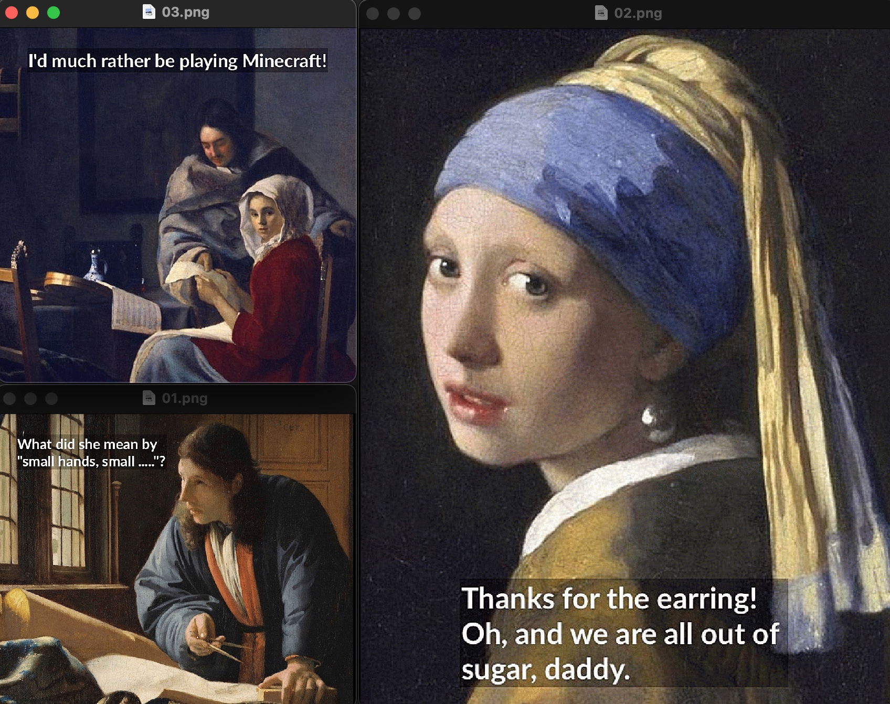

# Solana NFT Drop Project

## Renaissance Shade NFTs

### About This Project

NFT project No. 2. A far more intricate yet ultimately better NFT project using Solana, Metaplex, and the awesome Candy Machine. Kudos to Metaplex for creating an excellent tool.

I chose to have as the theme of the NFTs various images from Renaissance masters, primarily Dutch, with extremely non-Renaissance / Protestant Reformation comments from the people in the paintings. In other words, they were throwing shade. As the project made use of Arweave, and its low cost for perpetual storage, the size of images could be relatively "large" at 1MB or less each. Unfortunately, the code as it exists now requires png files, but if they were jpegs, 1MB would be more than adequate. (Modifying the Candy Machine could would eliminate these constraints -- at least I think it would.)

### What I Learned

We worked with the following "tools":
- Solana
- Metaplex (Candy Machine)
- Arweave!
- Phantom Wallet
- React
- Vercel
- Opensea

I was familiar with Vercel, React, and Opensea, but Solana, Metaplex, Candy Machine, Arweave, and the Phantom Wallet were new to me. I absolutely *love* working with Solana!

Metaplex and Candy Machine do a great job of providing a pseudo-frontend to the smart contract on the Solana blockchain. It abstracts away needing to write code in Rust and, more importantly, needing to write bug free and accurate code that will handle monetary transactions without error. 

Vercel was a breeze.

### URL for Project

URL for Solana NFT Project:
- [Solana NFT Drop Project - solnft.13z.dev](https://solnft.13z.dev)

The project is hosted at [Vercel](https://vercel.com).

### Sample NFTs

### Buildspace

[Buildspace](https://buildspace.so) provided excellent instruction with a very deep dive into the entire entire process minting NFTs using Solidity, Ethereum, and hardhat, as well as developing, testing, and deploying a web3 app.  

I received a [Buildspace NFT @ Opensea](https://opensea.io/assets/matic/0x3cd266509d127d0eac42f4474f57d0526804b44e/5480) for completing this project.) for completing this project.